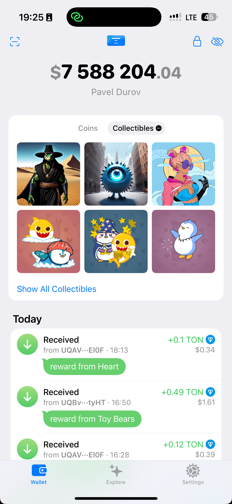
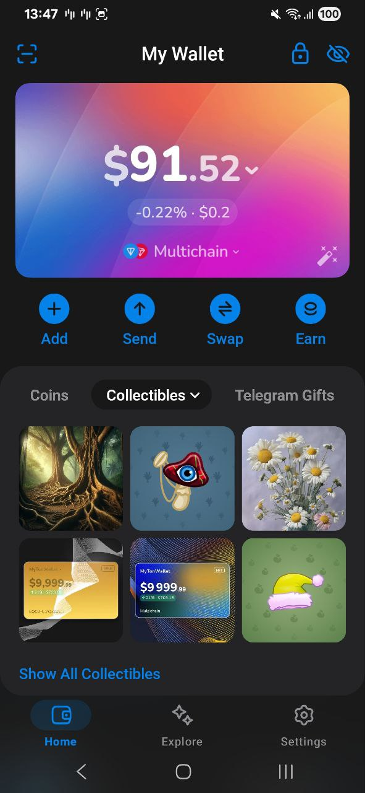

# ⚠️ Notice

This repository is **no longer maintained**.  
The latest source code of **MyTonWallet applications** is available here:  
👉 [https://github.com/mytonwallet-org/mytonwallet](https://github.com/mytonwallet-org/mytonwallet)

**MyTonWallet Air** has been fully **integrated into the main MyTonWallet application.**

📢 Learn more: [💎 Meet MyTonWallet Air — The Next-Generation Mobile Experience](https://t.me/MyTonWalletEn/298)

---

<h1>
  
  MyTonWallet Air (Public Beta)
</h1>

🏆 MyTonWallet Launches [Public Developer Contests](http://t.me/mycontests) ⚡

  
  

We believe the best products are born from collaboration with the community, so we invite everyone to participate in testing MyTonWallet Air—our new native app for iOS and Android.

This is a significant milestone for our wallet—native app integrates deeply with your device's operating system, using its standard elements and capabilities. The result is an app that runs significantly faster, feels more responsive, and becomes an integral part of your smartphone experience.

## How to build?

To view the project build instructions, you can refer to the [iOS](mobile/ios/Air/README.md) and [Android](mobile/android/air/README.md) readme files.
